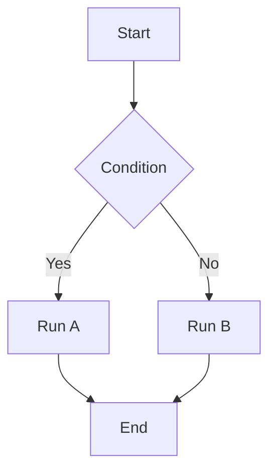

+++
title = "Adding Mermaid Diagrams to Your Zola Blog"
date = 2024-01-01T00:00:00+08:00
tags = ["Zola", "Mermaid", "Blogging"]
+++

How to add Mermaid diagram rendering to a Zola static blog.

## The Approach

Mermaid renders diagrams client-side in the browser — no backend required. The architecture:

```
Markdown → Zola build → Static HTML → Browser loads Mermaid.js → Renders diagrams
```

**The core idea:** load Mermaid.js on the page and have it automatically render `language-mermaid` code blocks.

---

## Setup Steps

### Step 1: Create the Mermaid Script

Create `static/js/mermaid.js`:

```javascript
document.addEventListener('DOMContentLoaded', function() {
    const mermaidBlocks = document.querySelectorAll('pre code.language-mermaid');
    if (mermaidBlocks.length === 0) return;
    
    const script = document.createElement('script');
    script.src = 'https://cdn.jsdelivr.net/npm/mermaid@10/dist/mermaid.min.js';
    
    script.onload = function() {
        mermaid.initialize({ startOnLoad: false, theme: 'default' });
        
        mermaidBlocks.forEach((block, index) => {
            const pre = block.parentElement;
            const code = block.textContent.trim();
            const container = document.createElement('div');
            container.className = 'mermaid-container';
            container.id = `mermaid-${index}`;
            
            pre.parentElement.insertBefore(container, pre);
            pre.remove();
            
            mermaid.render(`mermaid-${index}`, code).then(({ svg }) => {
                container.innerHTML = svg;
            });
        });
    };
    document.head.appendChild(script);
});
```

### Step 2: Load the Script in the Template

Add a script tag in `templates/base.html` before `</body>` to load `mermaid.js`, using Zola's `get_url` function to generate the correct path.

**See `templates/base.html` in this project for the actual implementation.**

### Step 3: Add Styles

Add Mermaid container styles to `static/sass/main.scss`:

```scss
.mermaid-container {
    margin: 1.5rem 0;
    padding: 1.5rem;
    background: #fff;
    border: 1px solid #e5e7eb;
    border-radius: 0.5rem;
    text-align: center;
    overflow-x: auto;
    
    svg {
        max-width: 100%;
        height: auto;
    }
}
```

---

## Usage

Use fenced `mermaid` code blocks in Markdown:



---

## Key File Reference

| File | Path |
|------|------|
| Mermaid script | `static/js/mermaid.js` |
| Template | `templates/base.html` |
| Stylesheet | `static/sass/main.scss` |
| Example post | `content/posts/mermaid 流程图使用指南.md` |

---

## References

| Resource | Link |
|----------|------|
| Mermaid docs | [mermaid.js.org](https://mermaid.js.org/) |
| Live editor | [mermaid.live](https://mermaid.live/) |
| Zola static files | [getzola.org](https://www.getzola.org/documentation/content/static-files/) |
| Zola templates | [getzola.org](https://www.getzola.org/documentation/templates/) |

---

## Notes

- Mermaid loads from CDN — requires internet access
- For offline use, download `mermaid.min.js` to `static/js/`
- Supports flowcharts, sequence diagrams, class diagrams, state diagrams, pie charts, Gantt charts, and more
