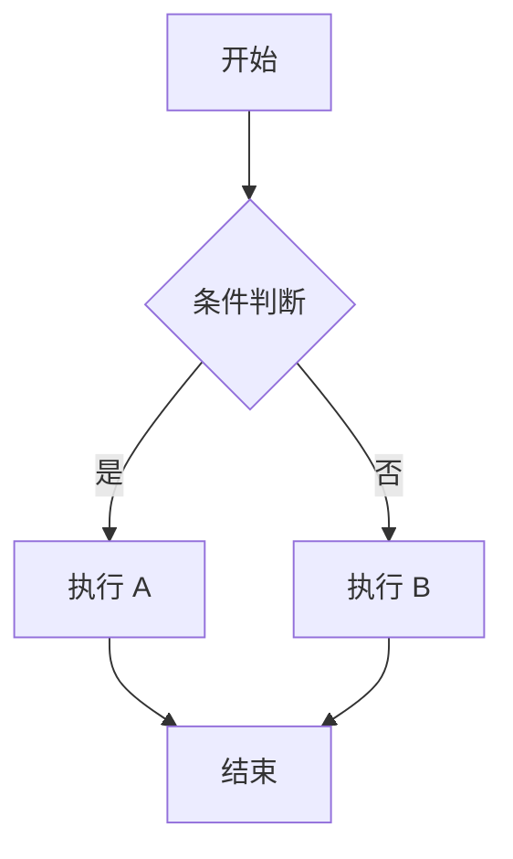

+++
title = 'Zola 博客支持 Mermaid 流程图'
date = 2024-01-01T00:00:00+08:00
tags = ['Zola', 'Mermaid', '博客配置']
+++

记录如何让 Zola 静态博客支持 Mermaid 图表渲染。

## 技术方案

Mermaid 是前端渲染的图表工具，无需后端支持。方案如下：

```
Markdown 写作 → Zola 构建 → 静态 HTML → 浏览器加载 Mermaid.js → 渲染图表
```

**核心：** 在页面中加载 Mermaid.js 脚本，自动渲染 `language-mermaid` 代码块。

---

## 配置步骤

### 步骤 1：创建 Mermaid 脚本

在 `static/js/mermaid.js` 创建以下脚本：

```javascript
document.addEventListener('DOMContentLoaded', function() {
    const mermaidBlocks = document.querySelectorAll('pre code.language-mermaid');
    if (mermaidBlocks.length === 0) return;
    
    const script = document.createElement('script');
    script.src = 'https://cdn.jsdelivr.net/npm/mermaid@10/dist/mermaid.min.js';
    
    script.onload = function() {
        mermaid.initialize({ startOnLoad: false, theme: 'default' });
        
        mermaidBlocks.forEach((block, index) => {
            const pre = block.parentElement;
            const code = block.textContent.trim();
            const container = document.createElement('div');
            container.className = 'mermaid-container';
            container.id = `mermaid-${index}`;
            
            pre.parentElement.insertBefore(container, pre);
            pre.remove();
            
            mermaid.render(`mermaid-${index}`, code).then(({ svg }) => {
                container.innerHTML = svg;
            });
        });
    };
    document.head.appendChild(script);
});
```

### 步骤 2：在模板中加载脚本

编辑 `templates/base.html` 文件，在 `</body>` 标签之前添加 script 标签引入 mermaid.js。

使用 Zola 的 `get_url` 函数生成正确的路径。

**实际代码请查看本项目的 `templates/base.html` 文件。**

### 步骤 3：添加样式

在 `static/sass/main.scss` 添加 Mermaid 容器样式：

```scss
.mermaid-container {
    margin: 1.5rem 0;
    padding: 1.5rem;
    background: #fff;
    border: 1px solid #e5e7eb;
    border-radius: 0.5rem;
    text-align: center;
    overflow-x: auto;
    
    svg {
        max-width: 100%;
        height: auto;
    }
}
```

---

## 使用方式

在 Markdown 中使用 `mermaid` 代码块：



---

## 关键文件参考

本项目的相关文件位置：

| 文件 | 路径 |
|------|------|
| Mermaid 脚本 | `static/js/mermaid.js` |
| 模板文件 | `templates/base.html` |
| 样式文件 | `static/sass/main.scss` |
| 示例文章 | `content/posts/mermaid 流程图使用指南.md` |

---

## 参考资源

| 资源 | 链接 |
|------|------|
| Mermaid 官方文档 | [mermaid.js.org](https://mermaid.js.org/) |
| 在线编辑器 | [mermaid.live](https://mermaid.live/) |
| Zola 静态文件 | [getzola.org - Static Files](https://www.getzola.org/documentation/content/static-files/) |
| Zola 模板 | [getzola.org - Templates](https://www.getzola.org/documentation/templates/) |

---

## 备注

- Mermaid 通过 CDN 加载，需要网络访问
- 如需离线使用，可下载 `mermaid.min.js` 到本地 `static/js/` 目录
- 支持流程图、序列图、类图、状态图、饼图、甘特图等
